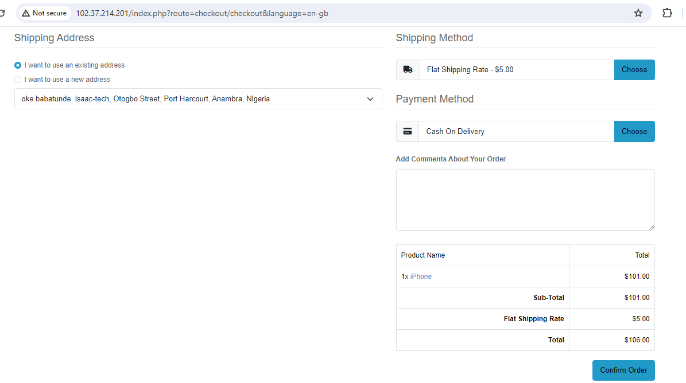
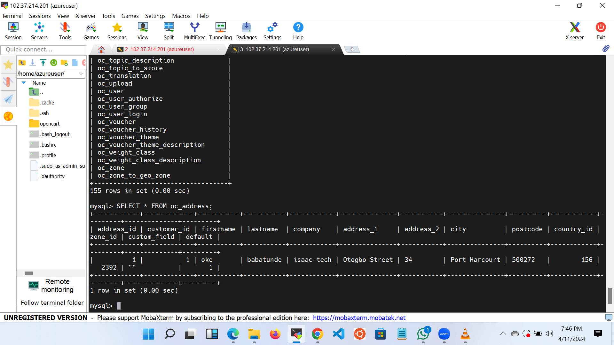

# OpenCart

# image of my opencart website

# opencart product list

# opencart checkout page

# mysql databse for customer details

## Overview  
''' sudo apt update -y ''' #update the operating system

'''sudo apt install apache2'''  #Install Apache web Server

'''sudo systemctl start Apache2'''  #Start Apache2 service

'''sudo systemctl enable Apache2''' 

'''sudo systemctl status Apache2''' #verify status of service

'''sudo apt-get install php php-cli lipapache2-mod-php php-gd php-mysql php-zip php-curl ''' 
 #php and additional modules to support opencart

'''php -v'''  #verify if php is installed

'''sudo mysql_secure_installation''' #secure installation

'''mysql -u root -p''' #log into your mysql shell

'''CREATE DATABASE opencart;'''

'''CREATE USER 'opencart'@'localhost'IDENTIFIED BY 'your-strong-password';

'''GRANT ALL PRIVILEGES ON opencart .* TO 'opencart' @'localhost';

'''FLUSH PRIVILEGES;'''

'''exit;'''

'''sudo wget https://github.com/opencart/opencart/releases/download/4.0.0.0/opencart-4.0.0.0.zip'''  #Download opencart

'''sudo apt -y install unzip'''  #unzip it 

''' sudo unzip opencart-4.0.0.0.zip -d /var/www/html/opencart/'''  #extract file into folder

'''sudo cp /var/www/html/opencart/upload/{config-dist.php,config.php}'''

'''sudo cp /var/www/html/opencart/upload/admin/{config-dist.php,config.php}'''

'''sudo chown -R www-data:www-data /var/www/html/opencart/''' #change ownership and enable permissions for the file

'''sudo chmod -R www-data:www-data /var/www/html/opencart/'''

'''sudo nano /etc/apache2/sites-available/opencart.conf''' #create virtualhost for opencart

'''sudo a2ensite opencart.conf'''  #to enable the site

'''sudo systemctl restart apache2'''  #restart apache2 to implement the changes

congratulations, you have successfully installed opencart!!

